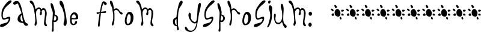
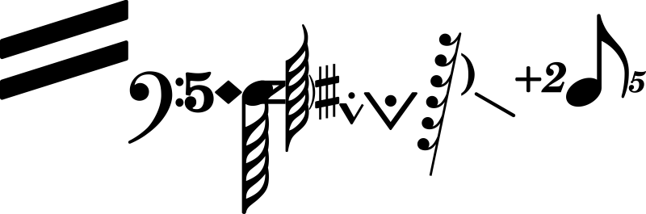
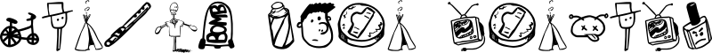

# go-fonts: Render open source fonts to polygons in Go

[](https://godoc.org/github.com/gmlewis/go-fonts/fonts)
[](https://github.com/gmlewis/go-fonts/actions?query=workflow%3AGo)

This is an experimental package used to render open source fonts to
polygons using Go.

As of version `v0.18.0`, all fonts have been moved to separate repos
due to the original repo being [just too huge](https://github.com/golang/go/issues/67996#issuecomment-2197565901).

They are now organized by the first letter of the name of the font:

```
github.com/gmlewis/go-fonts-a/fonts/aaarghnormal
...
github.com/gmlewis/go-fonts-b/fonts/baloo
...
github.com/gmlewis/go-fonts-z/fonts/znikomitno24
```

## Example usage

To use one or more fonts within a Go program, import the main
package and the font(s) you want, like this:

```go
import (
  "github.com/gmlewis/go-fonts/fonts"
  _ "github.com/gmlewis/go-fonts-u/fonts/ubuntumonoregular"
)
```

Then render the text to polygons and use them however you want:

```go
  xPos, yPos, xScale, yScale := 0.0, 0.0, 1.0, 1.0
  message := "Sample from ubuntumonoregular"
  render, err := fonts.Text(xPos, yPos, xScale, yScale, message, "ubuntumonoregular", &fonts.Center)
  if err != nil {
    log.Fatal(err)
  }
  log.Printf("MBB: %v", render.MBB)
  for i, poly := range render.Polygons {
    log.Printf("Polygon #%v/%v has %v points. MBB: %v", i+1, len(render.Polygons), len(poly.Pts), poly.MBB)
    // ...
  }
```

See https://github.com/gmlewis/go-gerber
or https://github.com/gmlewis/blackjack
for example applications that use this package.

----------------------------------------------------------------------

Enjoy!

----------------------------------------------------------------------

# License

Copyright 2019-2024 Glenn M. Lewis. All Rights Reserved.

Licensed under the Apache License, Version 2.0 (the "License");
you may not use this file except in compliance with the License.
You may obtain a copy of the License at

    http://www.apache.org/licenses/LICENSE-2.0

Unless required by applicable law or agreed to in writing, software
distributed under the License is distributed on an "AS IS" BASIS,
WITHOUT WARRANTIES OR CONDITIONS OF ANY KIND, either express or implied.
See the License for the specific language governing permissions and
limitations under the License.

----------------------------------------------------------------------

## Font samples
[](https://github.com/gmlewis/go-fonts-a/tree/master/fonts/aaarghnormal)
[](https://github.com/gmlewis/go-fonts-a/tree/master/fonts/abeezee_italic)
[](https://github.com/gmlewis/go-fonts-a/tree/master/fonts/abeezee_regular)
[](https://github.com/gmlewis/go-fonts-a/tree/master/fonts/abrilfatface_regular)
[](https://github.com/gmlewis/go-fonts-a/tree/master/fonts/acme_regular)
[](https://github.com/gmlewis/go-fonts-a/tree/master/fonts/actionjackson)
[](https://github.com/gmlewis/go-fonts-a/tree/master/fonts/actor_regular)
[](https://github.com/gmlewis/go-fonts-a/tree/master/fonts/aguafinascript_regular)
[](https://github.com/gmlewis/go-fonts-a/tree/master/fonts/aileron_black)
[](https://github.com/gmlewis/go-fonts-a/tree/master/fonts/aileron_blackitalic)
[](https://github.com/gmlewis/go-fonts-a/tree/master/fonts/aileron_bold)
[](https://github.com/gmlewis/go-fonts-a/tree/master/fonts/aileron_bolditalic)
[](https://github.com/gmlewis/go-fonts-a/tree/master/fonts/aileron_heavy)
[](https://github.com/gmlewis/go-fonts-a/tree/master/fonts/aileron_heavyitalic)
[](https://github.com/gmlewis/go-fonts-a/tree/master/fonts/aileron_italic)
[](https://github.com/gmlewis/go-fonts-a/tree/master/fonts/aileron_light)
[](https://github.com/gmlewis/go-fonts-a/tree/master/fonts/aileron_lightitalic)
[](https://github.com/gmlewis/go-fonts-a/tree/master/fonts/aileron_regular)
[](https://github.com/gmlewis/go-fonts-a/tree/master/fonts/aileron_semibold)
[](https://github.com/gmlewis/go-fonts-a/tree/master/fonts/aileron_semibolditalic)
[](https://github.com/gmlewis/go-fonts-a/tree/master/fonts/aileron_thin)
[](https://github.com/gmlewis/go-fonts-a/tree/master/fonts/aileron_thinitalic)
[](https://github.com/gmlewis/go-fonts-a/tree/master/fonts/aileron_ultralight)
[](https://github.com/gmlewis/go-fonts-a/tree/master/fonts/aileron_ultralightitalic)
[](https://github.com/gmlewis/go-fonts-a/tree/master/fonts/airstream)
[](https://github.com/gmlewis/go-fonts-a/tree/master/fonts/alegreya_black)
[](https://github.com/gmlewis/go-fonts-a/tree/master/fonts/alegreya_blackitalic)
[](https://github.com/gmlewis/go-fonts-a/tree/master/fonts/alegreya_bold)
[](https://github.com/gmlewis/go-fonts-a/tree/master/fonts/alegreya_bolditalic)
[](https://github.com/gmlewis/go-fonts-a/tree/master/fonts/alegreya_extrabold)
[](https://github.com/gmlewis/go-fonts-a/tree/master/fonts/alegreya_extrabolditalic)
[](https://github.com/gmlewis/go-fonts-a/tree/master/fonts/alegreya_italic)
[](https://github.com/gmlewis/go-fonts-a/tree/master/fonts/alegreya_medium)
[](https://github.com/gmlewis/go-fonts-a/tree/master/fonts/alegreya_mediumitalic)
[](https://github.com/gmlewis/go-fonts-a/tree/master/fonts/alegreya_regular)
[](https://github.com/gmlewis/go-fonts-a/tree/master/fonts/alegreya_semibold)
[](https://github.com/gmlewis/go-fonts-a/tree/master/fonts/alegreya_semibolditalic)
[](https://github.com/gmlewis/go-fonts-a/tree/master/fonts/alexbrush_regular)
[](https://github.com/gmlewis/go-fonts-a/tree/master/fonts/alfaslabone_regular)
[](https://github.com/gmlewis/go-fonts-a/tree/master/fonts/allura_regular)
[](https://github.com/gmlewis/go-fonts-a/tree/master/fonts/amaranth_bold)
[](https://github.com/gmlewis/go-fonts-a/tree/master/fonts/amaranth_bolditalic)
[](https://github.com/gmlewis/go-fonts-a/tree/master/fonts/amaranth_italic)
[](https://github.com/gmlewis/go-fonts-a/tree/master/fonts/amaranth_regular)
[](https://github.com/gmlewis/go-fonts-a/tree/master/fonts/amerika)
[](https://github.com/gmlewis/go-fonts-a/tree/master/fonts/amerikasans)
[](https://github.com/gmlewis/go-fonts-a/tree/master/fonts/amita_bold)
[](https://github.com/gmlewis/go-fonts-a/tree/master/fonts/amita_regular)
[](https://github.com/gmlewis/go-fonts-a/tree/master/fonts/anagram)
[](https://github.com/gmlewis/go-fonts-a/tree/master/fonts/angstrom)
[](https://github.com/gmlewis/go-fonts-a/tree/master/fonts/antelopeh)
[](https://github.com/gmlewis/go-fonts-a/tree/master/fonts/antimonyblue)
[](https://github.com/gmlewis/go-fonts-a/tree/master/fonts/aquilinetwo)
[](https://github.com/gmlewis/go-fonts-a/tree/master/fonts/arizonia_regular)
[](https://github.com/gmlewis/go-fonts-a/tree/master/fonts/arvo)
[](https://github.com/gmlewis/go-fonts-a/tree/master/fonts/arvo_bold)
[](https://github.com/gmlewis/go-fonts-a/tree/master/fonts/arvo_bolditalic)
[](https://github.com/gmlewis/go-fonts-a/tree/master/fonts/arvo_italic)
[](https://github.com/gmlewis/go-fonts-a/tree/master/fonts/asset_regular)
[](https://github.com/gmlewis/go-fonts-a/tree/master/fonts/atomicage_regular)
[](https://github.com/gmlewis/go-fonts-a/tree/master/fonts/averagesans_regular)
[](https://github.com/gmlewis/go-fonts-b/tree/master/fonts/baloo)
[](https://github.com/gmlewis/go-fonts-b/tree/master/fonts/baskervville_italic)
[](https://github.com/gmlewis/go-fonts-b/tree/master/fonts/baskervville_regular)
[](https://github.com/gmlewis/go-fonts-b/tree/master/fonts/berkshireswash_regular)
[](https://github.com/gmlewis/go-fonts-b/tree/master/fonts/bevan_italic)
[](https://github.com/gmlewis/go-fonts-b/tree/master/fonts/bevan_regular)
[](https://github.com/gmlewis/go-fonts-b/tree/master/fonts/bitstreamverasansmono_bold)
[](https://github.com/gmlewis/go-fonts-b/tree/master/fonts/bitstreamverasansmono_boldob)
[](https://github.com/gmlewis/go-fonts-b/tree/master/fonts/bitstreamverasansmono_oblique)
[](https://github.com/gmlewis/go-fonts-b/tree/master/fonts/bitstreamverasansmono_roman)
[](https://github.com/gmlewis/go-fonts-b/tree/master/fonts/blazium)
[](https://github.com/gmlewis/go-fonts-b/tree/master/fonts/boringboron)
[](https://github.com/gmlewis/go-fonts-c/tree/master/fonts/cacchampagne)
[](https://github.com/gmlewis/go-fonts-c/tree/master/fonts/carrelectronicdingbats)
[](https://github.com/gmlewis/go-fonts-c/tree/master/fonts/chivo_black)
[](https://github.com/gmlewis/go-fonts-c/tree/master/fonts/chivo_blackitalic)
[](https://github.com/gmlewis/go-fonts-c/tree/master/fonts/chivo_bold)
[](https://github.com/gmlewis/go-fonts-c/tree/master/fonts/chivo_bolditalic)
[](https://github.com/gmlewis/go-fonts-c/tree/master/fonts/chivo_extrabold)
[](https://github.com/gmlewis/go-fonts-c/tree/master/fonts/chivo_extrabolditalic)
[](https://github.com/gmlewis/go-fonts-c/tree/master/fonts/chivo_extralight)
[](https://github.com/gmlewis/go-fonts-c/tree/master/fonts/chivo_extralightitalic)
[](https://github.com/gmlewis/go-fonts-c/tree/master/fonts/chivo_italic)
[](https://github.com/gmlewis/go-fonts-c/tree/master/fonts/chivo_light)
[](https://github.com/gmlewis/go-fonts-c/tree/master/fonts/chivo_lightitalic)
[](https://github.com/gmlewis/go-fonts-c/tree/master/fonts/chivo_medium)
[](https://github.com/gmlewis/go-fonts-c/tree/master/fonts/chivo_mediumitalic)
[](https://github.com/gmlewis/go-fonts-c/tree/master/fonts/chivo_regular)
[](https://github.com/gmlewis/go-fonts-c/tree/master/fonts/chivo_semibold)
[](https://github.com/gmlewis/go-fonts-c/tree/master/fonts/chivo_semibolditalic)
[](https://github.com/gmlewis/go-fonts-c/tree/master/fonts/chivo_thin)
[](https://github.com/gmlewis/go-fonts-c/tree/master/fonts/chivo_thinitalic)
[](https://github.com/gmlewis/go-fonts-c/tree/master/fonts/codon)
[](https://github.com/gmlewis/go-fonts-c/tree/master/fonts/coiny_regular)
[](https://github.com/gmlewis/go-fonts-c/tree/master/fonts/colophondbz)
[](https://github.com/gmlewis/go-fonts-c/tree/master/fonts/combinumeralsltd)
[](https://github.com/gmlewis/go-fonts-c/tree/master/fonts/conventionalwisdom)
[](https://github.com/gmlewis/go-fonts-c/tree/master/fonts/cosinekatie)
[](https://github.com/gmlewis/go-fonts-c/tree/master/fonts/crimsontext_bold)
[](https://github.com/gmlewis/go-fonts-c/tree/master/fonts/crimsontext_bolditalic)
[](https://github.com/gmlewis/go-fonts-c/tree/master/fonts/crimsontext_italic)
[](https://github.com/gmlewis/go-fonts-c/tree/master/fonts/crimsontext_regular)
[](https://github.com/gmlewis/go-fonts-c/tree/master/fonts/crimsontext_semibold)
[](https://github.com/gmlewis/go-fonts-c/tree/master/fonts/crimsontext_semibolditalic)
[](https://github.com/gmlewis/go-fonts-d/tree/master/fonts/davis)
[](https://github.com/gmlewis/go-fonts-d/tree/master/fonts/davysregular)
[](https://github.com/gmlewis/go-fonts-d/tree/master/fonts/deliusswashcaps_regular)
[](https://github.com/gmlewis/go-fonts-d/tree/master/fonts/diplomata_regular)
[](https://github.com/gmlewis/go-fonts-d/tree/master/fonts/dissonant_fractured)
[](https://github.com/gmlewis/go-fonts-d/tree/master/fonts/dited)
[](https://github.com/gmlewis/go-fonts-d/tree/master/fonts/doctorazul)
[](https://github.com/gmlewis/go-fonts-d/tree/master/fonts/dohyeon_regular)
[](https://github.com/gmlewis/go-fonts-d/tree/master/fonts/donner)
[](https://github.com/gmlewis/go-fonts-d/tree/master/fonts/douglasadamshand)
[](https://github.com/gmlewis/go-fonts-d/tree/master/fonts/dysprosium)
[](https://github.com/gmlewis/go-fonts-e/tree/master/fonts/ebgaramond_bold)
[](https://github.com/gmlewis/go-fonts-e/tree/master/fonts/ebgaramond_bolditalic)
[](https://github.com/gmlewis/go-fonts-e/tree/master/fonts/ebgaramond_extrabold)
[](https://github.com/gmlewis/go-fonts-e/tree/master/fonts/ebgaramond_extrabolditalic)
[](https://github.com/gmlewis/go-fonts-e/tree/master/fonts/ebgaramond_italic)
[](https://github.com/gmlewis/go-fonts-e/tree/master/fonts/ebgaramond_medium)
[](https://github.com/gmlewis/go-fonts-e/tree/master/fonts/ebgaramond_mediumitalic)
[](https://github.com/gmlewis/go-fonts-e/tree/master/fonts/ebgaramond_regular)
[](https://github.com/gmlewis/go-fonts-e/tree/master/fonts/ebgaramond_semibold)
[](https://github.com/gmlewis/go-fonts-e/tree/master/fonts/ebgaramond_semibolditalic)
[](https://github.com/gmlewis/go-fonts-e/tree/master/fonts/edwin_bdita)
[](https://github.com/gmlewis/go-fonts-e/tree/master/fonts/edwin_bold)
[](https://github.com/gmlewis/go-fonts-e/tree/master/fonts/edwin_italic)
[](https://github.com/gmlewis/go-fonts-e/tree/master/fonts/edwin_roman)
[](https://github.com/gmlewis/go-fonts-e/tree/master/fonts/embossedblack_normal)
[](https://github.com/gmlewis/go-fonts-e/tree/master/fonts/embossedblackwide_normal)
[](https://github.com/gmlewis/go-fonts-e/tree/master/fonts/englandhanddb)
[](https://github.com/gmlewis/go-fonts-e/tree/master/fonts/entypo)
[](https://github.com/gmlewis/go-fonts-e/tree/master/fonts/epilog)
[](https://github.com/gmlewis/go-fonts-f/tree/master/fonts/f20db)
[](https://github.com/gmlewis/go-fonts-f/tree/master/fonts/f2dumb)
[](https://github.com/gmlewis/go-fonts-f/tree/master/fonts/f32768no)
[](https://github.com/gmlewis/go-fonts-f/tree/master/fonts/f7hours)
[](https://github.com/gmlewis/go-fonts-f/tree/master/fonts/fantasquesansmono_bold)
[](https://github.com/gmlewis/go-fonts-f/tree/master/fonts/fantasquesansmono_bolditalic)
[](https://github.com/gmlewis/go-fonts-f/tree/master/fonts/fantasquesansmono_italic)
[](https://github.com/gmlewis/go-fonts-f/tree/master/fonts/fantasquesansmono_regular)
[](https://github.com/gmlewis/go-fonts-f/tree/master/fonts/faraday)
[](https://github.com/gmlewis/go-fonts-f/tree/master/fonts/fascinate_inlineregular)
[](https://github.com/gmlewis/go-fonts-f/tree/master/fonts/fauxsnowbrk)
[](https://github.com/gmlewis/go-fonts-f/tree/master/fonts/firasans_black)
[](https://github.com/gmlewis/go-fonts-f/tree/master/fonts/firasans_blackitalic)
[](https://github.com/gmlewis/go-fonts-f/tree/master/fonts/firasans_bold)
[](https://github.com/gmlewis/go-fonts-f/tree/master/fonts/firasans_bolditalic)
[](https://github.com/gmlewis/go-fonts-f/tree/master/fonts/firasans_extrabold)
[](https://github.com/gmlewis/go-fonts-f/tree/master/fonts/firasans_extrabolditalic)
[](https://github.com/gmlewis/go-fonts-f/tree/master/fonts/firasans_extralight)
[](https://github.com/gmlewis/go-fonts-f/tree/master/fonts/firasans_extralightitalic)
[](https://github.com/gmlewis/go-fonts-f/tree/master/fonts/firasans_italic)
[](https://github.com/gmlewis/go-fonts-f/tree/master/fonts/firasans_light)
[](https://github.com/gmlewis/go-fonts-f/tree/master/fonts/firasans_lightitalic)
[](https://github.com/gmlewis/go-fonts-f/tree/master/fonts/firasans_medium)
[](https://github.com/gmlewis/go-fonts-f/tree/master/fonts/firasans_mediumitalic)
[](https://github.com/gmlewis/go-fonts-f/tree/master/fonts/firasans_regular)
[](https://github.com/gmlewis/go-fonts-f/tree/master/fonts/firasans_semibold)
[](https://github.com/gmlewis/go-fonts-f/tree/master/fonts/firasans_semibolditalic)
[](https://github.com/gmlewis/go-fonts-f/tree/master/fonts/firasans_thin)
[](https://github.com/gmlewis/go-fonts-f/tree/master/fonts/firasans_thinitalic)
[](https://github.com/gmlewis/go-fonts-f/tree/master/fonts/fixedersys1x)
[](https://github.com/gmlewis/go-fonts-f/tree/master/fonts/fixedersys2x)
[](https://github.com/gmlewis/go-fonts-f/tree/master/fonts/fixedersyslight2x)
[](https://github.com/gmlewis/go-fonts-f/tree/master/fonts/fjallaone_regular)
[](https://github.com/gmlewis/go-fonts-f/tree/master/fonts/fjord_one)
[](https://github.com/gmlewis/go-fonts-f/tree/master/fonts/floralia)
[](https://github.com/gmlewis/go-fonts-f/tree/master/fonts/font3933)
[](https://github.com/gmlewis/go-fonts-f/tree/master/fonts/fontleroybrown)
[](https://github.com/gmlewis/go-fonts-f/tree/master/fonts/forum)
[](https://github.com/gmlewis/go-fonts-f/tree/master/fonts/freebooterscript)
[](https://github.com/gmlewis/go-fonts-f/tree/master/fonts/freemono)
[](https://github.com/gmlewis/go-fonts-f/tree/master/fonts/freemonobold)
[](https://github.com/gmlewis/go-fonts-f/tree/master/fonts/freemonoboldoblique)
[](https://github.com/gmlewis/go-fonts-f/tree/master/fonts/freemonooblique)
[](https://github.com/gmlewis/go-fonts-f/tree/master/fonts/freesans)
[](https://github.com/gmlewis/go-fonts-f/tree/master/fonts/freesansbold)
[](https://github.com/gmlewis/go-fonts-f/tree/master/fonts/freesansboldoblique)
[](https://github.com/gmlewis/go-fonts-f/tree/master/fonts/freesansoblique)
[](https://github.com/gmlewis/go-fonts-f/tree/master/fonts/freeserif)
[](https://github.com/gmlewis/go-fonts-f/tree/master/fonts/freeserifbold)
[](https://github.com/gmlewis/go-fonts-f/tree/master/fonts/freeserifbolditalic)
[](https://github.com/gmlewis/go-fonts-f/tree/master/fonts/freeserifitalic)
[](https://github.com/gmlewis/go-fonts-f/tree/master/fonts/fresnel)
[](https://github.com/gmlewis/go-fonts-g/tree/master/fonts/gaussjordan)
[](https://github.com/gmlewis/go-fonts-g/tree/master/fonts/genzschetheyse)
[](https://github.com/gmlewis/go-fonts-g/tree/master/fonts/genzschetheysealternate)
[](https://github.com/gmlewis/go-fonts-g/tree/master/fonts/geodesic)
[](https://github.com/gmlewis/go-fonts-g/tree/master/fonts/geometrysoftpro_boldn)
[](https://github.com/gmlewis/go-fonts-g/tree/master/fonts/germs)
[](https://github.com/gmlewis/go-fonts-g/tree/master/fonts/gooddogregular)
[](https://github.com/gmlewis/go-fonts-g/tree/master/fonts/goudystm)
[](https://github.com/gmlewis/go-fonts-g/tree/master/fonts/goudystm_italic)
[](https://github.com/gmlewis/go-fonts-g/tree/master/fonts/grandhotel_regular)
[](https://github.com/gmlewis/go-fonts-g/tree/master/fonts/gravitasone)
[](https://github.com/gmlewis/go-fonts-g/tree/master/fonts/greatvibes_regular)
[](https://github.com/gmlewis/go-fonts-g/tree/master/fonts/greenwichmeantime)
[](https://github.com/gmlewis/go-fonts-g/tree/master/fonts/grutchshaded)
[](https://github.com/gmlewis/go-fonts-g/tree/master/fonts/guildofprofessionalactors)
[](https://github.com/gmlewis/go-fonts-h/tree/master/fonts/hanalei_regular)
[](https://github.com/gmlewis/go-fonts-h/tree/master/fonts/hanaleifill_regular)
[](https://github.com/gmlewis/go-fonts-h/tree/master/fonts/headhunter_regular)
[](https://github.com/gmlewis/go-fonts-h/tree/master/fonts/heavydata)
[](https://github.com/gmlewis/go-fonts-h/tree/master/fonts/helsinkiregular)
[](https://github.com/gmlewis/go-fonts-h/tree/master/fonts/heydingsicons)
[](https://github.com/gmlewis/go-fonts-h/tree/master/fonts/hockeyislif)
[](https://github.com/gmlewis/go-fonts-h/tree/master/fonts/hydrogenscore)
[](https://github.com/gmlewis/go-fonts-i/tree/master/fonts/im_fell_flowers_2)
[](https://github.com/gmlewis/go-fonts-i/tree/master/fonts/impactlabel)
[](https://github.com/gmlewis/go-fonts-i/tree/master/fonts/impactlabelreversed)
[](https://github.com/gmlewis/go-fonts-i/tree/master/fonts/incisedblack_normal)
[](https://github.com/gmlewis/go-fonts-i/tree/master/fonts/incisedblackwide_normal)
[](https://github.com/gmlewis/go-fonts-i/tree/master/fonts/inconsolata)
[](https://github.com/gmlewis/go-fonts-i/tree/master/fonts/initial)
[](https://github.com/gmlewis/go-fonts-i/tree/master/fonts/isuckatgolf)
[](https://github.com/gmlewis/go-fonts-i/tree/master/fonts/italiana_regular)
[](https://github.com/gmlewis/go-fonts-i/tree/master/fonts/italianno_regular)
[](https://github.com/gmlewis/go-fonts-j/tree/master/fonts/josefinslab_bold)
[](https://github.com/gmlewis/go-fonts-j/tree/master/fonts/josefinslab_bolditalic)
[](https://github.com/gmlewis/go-fonts-j/tree/master/fonts/josefinslab_extralight)
[](https://github.com/gmlewis/go-fonts-j/tree/master/fonts/josefinslab_extralightitalic)
[](https://github.com/gmlewis/go-fonts-j/tree/master/fonts/josefinslab_italic)
[](https://github.com/gmlewis/go-fonts-j/tree/master/fonts/josefinslab_light)
[](https://github.com/gmlewis/go-fonts-j/tree/master/fonts/josefinslab_lightitalic)
[](https://github.com/gmlewis/go-fonts-j/tree/master/fonts/josefinslab_medium)
[](https://github.com/gmlewis/go-fonts-j/tree/master/fonts/josefinslab_mediumitalic)
[](https://github.com/gmlewis/go-fonts-j/tree/master/fonts/josefinslab_regular)
[](https://github.com/gmlewis/go-fonts-j/tree/master/fonts/josefinslab_semibold)
[](https://github.com/gmlewis/go-fonts-j/tree/master/fonts/josefinslab_semibolditalic)
[](https://github.com/gmlewis/go-fonts-j/tree/master/fonts/josefinslab_thin)
[](https://github.com/gmlewis/go-fonts-j/tree/master/fonts/josefinslab_thinitalic)
[](https://github.com/gmlewis/go-fonts-j/tree/master/fonts/jura_bold)
[](https://github.com/gmlewis/go-fonts-j/tree/master/fonts/jura_light)
[](https://github.com/gmlewis/go-fonts-j/tree/master/fonts/jura_medium)
[](https://github.com/gmlewis/go-fonts-j/tree/master/fonts/jura_regular)
[](https://github.com/gmlewis/go-fonts-j/tree/master/fonts/jura_semibold)
[](https://github.com/gmlewis/go-fonts-k/tree/master/fonts/kavivanar_regular)
[](https://github.com/gmlewis/go-fonts-k/tree/master/fonts/kawoszeh)
[](https://github.com/gmlewis/go-fonts-k/tree/master/fonts/kellssd)
[](https://github.com/gmlewis/go-fonts-k/tree/master/fonts/kingthingsitalique)
[](https://github.com/gmlewis/go-fonts-k/tree/master/fonts/kingthingsxstitch)
[](https://github.com/gmlewis/go-fonts-k/tree/master/fonts/konstytucyja)
[](https://github.com/gmlewis/go-fonts-k/tree/master/fonts/kreon_bold)
[](https://github.com/gmlewis/go-fonts-k/tree/master/fonts/kreon_light)
[](https://github.com/gmlewis/go-fonts-k/tree/master/fonts/kreon_medium)
[](https://github.com/gmlewis/go-fonts-k/tree/master/fonts/kreon_regular)
[](https://github.com/gmlewis/go-fonts-k/tree/master/fonts/kreon_semibold)
[](https://github.com/gmlewis/go-fonts-l/tree/master/fonts/landliebe)
[](https://github.com/gmlewis/go-fonts-l/tree/master/fonts/lato_black)
[](https://github.com/gmlewis/go-fonts-l/tree/master/fonts/lato_blackitalic)
[](https://github.com/gmlewis/go-fonts-l/tree/master/fonts/lato_bold)
[](https://github.com/gmlewis/go-fonts-l/tree/master/fonts/lato_bolditalic)
[](https://github.com/gmlewis/go-fonts-l/tree/master/fonts/lato_hairline)
[](https://github.com/gmlewis/go-fonts-l/tree/master/fonts/lato_hairlineitalic)
[](https://github.com/gmlewis/go-fonts-l/tree/master/fonts/lato_italic)
[](https://github.com/gmlewis/go-fonts-l/tree/master/fonts/lato_light)
[](https://github.com/gmlewis/go-fonts-l/tree/master/fonts/lato_lightitalic)
[](https://github.com/gmlewis/go-fonts-l/tree/master/fonts/lato_regular)
[](https://github.com/gmlewis/go-fonts-l/tree/master/fonts/latoregular)
[](https://github.com/gmlewis/go-fonts-l/tree/master/fonts/leaguescriptthin_regular)
[](https://github.com/gmlewis/go-fonts-l/tree/master/fonts/ledger_regular)
[](https://github.com/gmlewis/go-fonts-l/tree/master/fonts/leland)
[](https://github.com/gmlewis/go-fonts-l/tree/master/fonts/lelandtext)
[](https://github.com/gmlewis/go-fonts-l/tree/master/fonts/levity)
[](https://github.com/gmlewis/go-fonts-l/tree/master/fonts/lexographer)
[](https://github.com/gmlewis/go-fonts-l/tree/master/fonts/librebaskerville_bold)
[](https://github.com/gmlewis/go-fonts-l/tree/master/fonts/librebaskerville_italic)
[](https://github.com/gmlewis/go-fonts-l/tree/master/fonts/librebaskerville_regular)
[](https://github.com/gmlewis/go-fonts-l/tree/master/fonts/linear)
[](https://github.com/gmlewis/go-fonts-l/tree/master/fonts/lobstertwo)
[](https://github.com/gmlewis/go-fonts-l/tree/master/fonts/lobstertwo_bold)
[](https://github.com/gmlewis/go-fonts-l/tree/master/fonts/lobstertwo_bolditalic)
[](https://github.com/gmlewis/go-fonts-l/tree/master/fonts/lobstertwo_italic)
[](https://github.com/gmlewis/go-fonts-l/tree/master/fonts/lora_bold)
[](https://github.com/gmlewis/go-fonts-l/tree/master/fonts/lora_bolditalic)
[](https://github.com/gmlewis/go-fonts-l/tree/master/fonts/lora_italic)
[](https://github.com/gmlewis/go-fonts-l/tree/master/fonts/lora_medium)
[](https://github.com/gmlewis/go-fonts-l/tree/master/fonts/lora_mediumitalic)
[](https://github.com/gmlewis/go-fonts-l/tree/master/fonts/lora_regular)
[](https://github.com/gmlewis/go-fonts-l/tree/master/fonts/lora_semibold)
[](https://github.com/gmlewis/go-fonts-l/tree/master/fonts/lora_semibolditalic)
[](https://github.com/gmlewis/go-fonts-l/tree/master/fonts/loversquarrel_regular)
[](https://github.com/gmlewis/go-fonts-m/tree/master/fonts/mayqueen)
[](https://github.com/gmlewis/go-fonts-m/tree/master/fonts/melaniegirly)
[](https://github.com/gmlewis/go-fonts-m/tree/master/fonts/membra)
[](https://github.com/gmlewis/go-fonts-m/tree/master/fonts/merriweather_black)
[](https://github.com/gmlewis/go-fonts-m/tree/master/fonts/merriweather_blackitalic)
[](https://github.com/gmlewis/go-fonts-m/tree/master/fonts/merriweather_bold)
[](https://github.com/gmlewis/go-fonts-m/tree/master/fonts/merriweather_bolditalic)
[](https://github.com/gmlewis/go-fonts-m/tree/master/fonts/merriweather_italic)
[](https://github.com/gmlewis/go-fonts-m/tree/master/fonts/merriweather_light)
[](https://github.com/gmlewis/go-fonts-m/tree/master/fonts/merriweather_lightitalic)
[](https://github.com/gmlewis/go-fonts-m/tree/master/fonts/merriweather_regular)
[](https://github.com/gmlewis/go-fonts-m/tree/master/fonts/metalanguage)
[](https://github.com/gmlewis/go-fonts-m/tree/master/fonts/miama)
[](https://github.com/gmlewis/go-fonts-m/tree/master/fonts/modak)
[](https://github.com/gmlewis/go-fonts-m/tree/master/fonts/monospacetypewriter)
[](https://github.com/gmlewis/go-fonts-m/tree/master/fonts/monoton_regular)
[](https://github.com/gmlewis/go-fonts-m/tree/master/fonts/montez_regular)
[](https://github.com/gmlewis/go-fonts-m/tree/master/fonts/montserrat_black)
[](https://github.com/gmlewis/go-fonts-m/tree/master/fonts/montserrat_blackitalic)
[](https://github.com/gmlewis/go-fonts-m/tree/master/fonts/montserrat_bold)
[](https://github.com/gmlewis/go-fonts-m/tree/master/fonts/montserrat_bolditalic)
[](https://github.com/gmlewis/go-fonts-m/tree/master/fonts/montserrat_extrabold)
[](https://github.com/gmlewis/go-fonts-m/tree/master/fonts/montserrat_extrabolditalic)
[](https://github.com/gmlewis/go-fonts-m/tree/master/fonts/montserrat_extralight)
[](https://github.com/gmlewis/go-fonts-m/tree/master/fonts/montserrat_extralightitalic)
[](https://github.com/gmlewis/go-fonts-m/tree/master/fonts/montserrat_italic)
[](https://github.com/gmlewis/go-fonts-m/tree/master/fonts/montserrat_light)
[](https://github.com/gmlewis/go-fonts-m/tree/master/fonts/montserrat_lightitalic)
[](https://github.com/gmlewis/go-fonts-m/tree/master/fonts/montserrat_medium)
[](https://github.com/gmlewis/go-fonts-m/tree/master/fonts/montserrat_mediumitalic)
[](https://github.com/gmlewis/go-fonts-m/tree/master/fonts/montserrat_regular)
[](https://github.com/gmlewis/go-fonts-m/tree/master/fonts/montserrat_semibold)
[](https://github.com/gmlewis/go-fonts-m/tree/master/fonts/montserrat_semibolditalic)
[](https://github.com/gmlewis/go-fonts-m/tree/master/fonts/montserrat_thin)
[](https://github.com/gmlewis/go-fonts-m/tree/master/fonts/montserrat_thinitalic)
[](https://github.com/gmlewis/go-fonts-m/tree/master/fonts/mothproofscript)
[](https://github.com/gmlewis/go-fonts-m/tree/master/fonts/mplus1p_black)
[](https://github.com/gmlewis/go-fonts-m/tree/master/fonts/mplus1p_bold)
[](https://github.com/gmlewis/go-fonts-m/tree/master/fonts/mplus1p_extrabold)
[](https://github.com/gmlewis/go-fonts-m/tree/master/fonts/mplus1p_light)
[](https://github.com/gmlewis/go-fonts-m/tree/master/fonts/mplus1p_medium)
[](https://github.com/gmlewis/go-fonts-m/tree/master/fonts/mplus1p_regular)
[](https://github.com/gmlewis/go-fonts-m/tree/master/fonts/mplus1p_thin)
[](https://github.com/gmlewis/go-fonts-m/tree/master/fonts/mrkmaston_bold)
[](https://github.com/gmlewis/go-fonts-m/tree/master/fonts/mrkmaston_regular)
[](https://github.com/gmlewis/go-fonts-m/tree/master/fonts/musicdbz)
[](https://github.com/gmlewis/go-fonts-n/tree/master/fonts/naturallog)
[](https://github.com/gmlewis/go-fonts-n/tree/master/fonts/nonblockingsocket)
[](https://github.com/gmlewis/go-fonts-n/tree/master/fonts/notosans_black)
[](https://github.com/gmlewis/go-fonts-n/tree/master/fonts/notosans_blackitalic)
[](https://github.com/gmlewis/go-fonts-n/tree/master/fonts/notosans_bold)
[](https://github.com/gmlewis/go-fonts-n/tree/master/fonts/notosans_bolditalic)
[](https://github.com/gmlewis/go-fonts-n/tree/master/fonts/notosans_extrabold)
[](https://github.com/gmlewis/go-fonts-n/tree/master/fonts/notosans_extrabolditalic)
[](https://github.com/gmlewis/go-fonts-n/tree/master/fonts/notosans_extralight)
[](https://github.com/gmlewis/go-fonts-n/tree/master/fonts/notosans_extralightitalic)
[](https://github.com/gmlewis/go-fonts-n/tree/master/fonts/notosans_italic)
[](https://github.com/gmlewis/go-fonts-n/tree/master/fonts/notosans_light)
[](https://github.com/gmlewis/go-fonts-n/tree/master/fonts/notosans_lightitalic)
[](https://github.com/gmlewis/go-fonts-n/tree/master/fonts/notosans_medium)
[](https://github.com/gmlewis/go-fonts-n/tree/master/fonts/notosans_mediumitalic)
[](https://github.com/gmlewis/go-fonts-n/tree/master/fonts/notosans_regular)
[](https://github.com/gmlewis/go-fonts-n/tree/master/fonts/notosans_semibold)
[](https://github.com/gmlewis/go-fonts-n/tree/master/fonts/notosans_semibolditalic)
[](https://github.com/gmlewis/go-fonts-n/tree/master/fonts/notosans_thin)
[](https://github.com/gmlewis/go-fonts-n/tree/master/fonts/notosans_thinitalic)
[](https://github.com/gmlewis/go-fonts-n/tree/master/fonts/notosanscondensed_black)
[](https://github.com/gmlewis/go-fonts-n/tree/master/fonts/notosanscondensed_blackitalic)
[](https://github.com/gmlewis/go-fonts-n/tree/master/fonts/notosanscondensed_bold)
[](https://github.com/gmlewis/go-fonts-n/tree/master/fonts/notosanscondensed_bolditalic)
[](https://github.com/gmlewis/go-fonts-n/tree/master/fonts/notosanscondensed_extrabold)
[](https://github.com/gmlewis/go-fonts-n/tree/master/fonts/notosanscondensed_extrabolditalic)
[](https://github.com/gmlewis/go-fonts-n/tree/master/fonts/notosanscondensed_extralight)
[](https://github.com/gmlewis/go-fonts-n/tree/master/fonts/notosanscondensed_extralightitalic)
[](https://github.com/gmlewis/go-fonts-n/tree/master/fonts/notosanscondensed_italic)
[](https://github.com/gmlewis/go-fonts-n/tree/master/fonts/notosanscondensed_light)
[](https://github.com/gmlewis/go-fonts-n/tree/master/fonts/notosanscondensed_lightitalic)
[](https://github.com/gmlewis/go-fonts-n/tree/master/fonts/notosanscondensed_medium)
[](https://github.com/gmlewis/go-fonts-n/tree/master/fonts/notosanscondensed_mediumitalic)
[](https://github.com/gmlewis/go-fonts-n/tree/master/fonts/notosanscondensed_regular)
[](https://github.com/gmlewis/go-fonts-n/tree/master/fonts/notosanscondensed_semibold)
[](https://github.com/gmlewis/go-fonts-n/tree/master/fonts/notosanscondensed_semibolditalic)
[](https://github.com/gmlewis/go-fonts-n/tree/master/fonts/notosanscondensed_thin)
[](https://github.com/gmlewis/go-fonts-n/tree/master/fonts/notosanscondensed_thinitalic)
[](https://github.com/gmlewis/go-fonts-n/tree/master/fonts/notosansextracondensed_black)
[](https://github.com/gmlewis/go-fonts-n/tree/master/fonts/notosansextracondensed_blackitalic)
[](https://github.com/gmlewis/go-fonts-n/tree/master/fonts/notosansextracondensed_bold)
[](https://github.com/gmlewis/go-fonts-n/tree/master/fonts/notosansextracondensed_bolditalic)
[](https://github.com/gmlewis/go-fonts-n/tree/master/fonts/notosansextracondensed_extrabold)
[](https://github.com/gmlewis/go-fonts-n/tree/master/fonts/notosansextracondensed_extrabolditalic)
[](https://github.com/gmlewis/go-fonts-n/tree/master/fonts/notosansextracondensed_extralight)
[](https://github.com/gmlewis/go-fonts-n/tree/master/fonts/notosansextracondensed_extralightitalic)
[](https://github.com/gmlewis/go-fonts-n/tree/master/fonts/notosansextracondensed_italic)
[](https://github.com/gmlewis/go-fonts-n/tree/master/fonts/notosansextracondensed_light)
[](https://github.com/gmlewis/go-fonts-n/tree/master/fonts/notosansextracondensed_lightitalic)
[](https://github.com/gmlewis/go-fonts-n/tree/master/fonts/notosansextracondensed_medium)
[](https://github.com/gmlewis/go-fonts-n/tree/master/fonts/notosansextracondensed_mediumitalic)
[](https://github.com/gmlewis/go-fonts-n/tree/master/fonts/notosansextracondensed_regular)
[](https://github.com/gmlewis/go-fonts-n/tree/master/fonts/notosansextracondensed_semibold)
[](https://github.com/gmlewis/go-fonts-n/tree/master/fonts/notosansextracondensed_semibolditalic)
[](https://github.com/gmlewis/go-fonts-n/tree/master/fonts/notosansextracondensed_thin)
[](https://github.com/gmlewis/go-fonts-n/tree/master/fonts/notosansextracondensed_thinitalic)
[](https://github.com/gmlewis/go-fonts-n/tree/master/fonts/notosanssemicondensed_black)
[](https://github.com/gmlewis/go-fonts-n/tree/master/fonts/notosanssemicondensed_blackitalic)
[](https://github.com/gmlewis/go-fonts-n/tree/master/fonts/notosanssemicondensed_bold)
[](https://github.com/gmlewis/go-fonts-n/tree/master/fonts/notosanssemicondensed_bolditalic)
[](https://github.com/gmlewis/go-fonts-n/tree/master/fonts/notosanssemicondensed_extrabold)
[](https://github.com/gmlewis/go-fonts-n/tree/master/fonts/notosanssemicondensed_extrabolditalic)
[](https://github.com/gmlewis/go-fonts-n/tree/master/fonts/notosanssemicondensed_extralight)
[](https://github.com/gmlewis/go-fonts-n/tree/master/fonts/notosanssemicondensed_extralightitalic)
[](https://github.com/gmlewis/go-fonts-n/tree/master/fonts/notosanssemicondensed_italic)
[](https://github.com/gmlewis/go-fonts-n/tree/master/fonts/notosanssemicondensed_light)
[](https://github.com/gmlewis/go-fonts-n/tree/master/fonts/notosanssemicondensed_lightitalic)
[](https://github.com/gmlewis/go-fonts-n/tree/master/fonts/notosanssemicondensed_medium)
[](https://github.com/gmlewis/go-fonts-n/tree/master/fonts/notosanssemicondensed_mediumitalic)
[](https://github.com/gmlewis/go-fonts-n/tree/master/fonts/notosanssemicondensed_regular)
[](https://github.com/gmlewis/go-fonts-n/tree/master/fonts/notosanssemicondensed_semibold)
[](https://github.com/gmlewis/go-fonts-n/tree/master/fonts/notosanssemicondensed_semibolditalic)
[](https://github.com/gmlewis/go-fonts-n/tree/master/fonts/notosanssemicondensed_thin)
[](https://github.com/gmlewis/go-fonts-n/tree/master/fonts/notosanssemicondensed_thinitalic)
[](https://github.com/gmlewis/go-fonts-n/tree/master/fonts/nullpointer)
[](https://github.com/gmlewis/go-fonts-o/tree/master/fonts/oi_regular)
[](https://github.com/gmlewis/go-fonts-o/tree/master/fonts/oldstandardtt_bold)
[](https://github.com/gmlewis/go-fonts-o/tree/master/fonts/oldstandardtt_italic)
[](https://github.com/gmlewis/go-fonts-o/tree/master/fonts/oldstandardtt_regular)
[](https://github.com/gmlewis/go-fonts-o/tree/master/fonts/oneconstant)
[](https://github.com/gmlewis/go-fonts-o/tree/master/fonts/opensans_bold)
[](https://github.com/gmlewis/go-fonts-o/tree/master/fonts/opensans_bolditalic)
[](https://github.com/gmlewis/go-fonts-o/tree/master/fonts/opensans_extrabold)
[](https://github.com/gmlewis/go-fonts-o/tree/master/fonts/opensans_extrabolditalic)
[](https://github.com/gmlewis/go-fonts-o/tree/master/fonts/opensans_italic)
[](https://github.com/gmlewis/go-fonts-o/tree/master/fonts/opensans_light)
[](https://github.com/gmlewis/go-fonts-o/tree/master/fonts/opensans_lightitalic)
[](https://github.com/gmlewis/go-fonts-o/tree/master/fonts/opensans_medium)
[](https://github.com/gmlewis/go-fonts-o/tree/master/fonts/opensans_mediumitalic)
[](https://github.com/gmlewis/go-fonts-o/tree/master/fonts/opensans_regular)
[](https://github.com/gmlewis/go-fonts-o/tree/master/fonts/opensans_semibold)
[](https://github.com/gmlewis/go-fonts-o/tree/master/fonts/opensans_semibolditalic)
[](https://github.com/gmlewis/go-fonts-o/tree/master/fonts/opensanscondensed_bold)
[](https://github.com/gmlewis/go-fonts-o/tree/master/fonts/opensanscondensed_bolditalic)
[](https://github.com/gmlewis/go-fonts-o/tree/master/fonts/opensanscondensed_extrabold)
[](https://github.com/gmlewis/go-fonts-o/tree/master/fonts/opensanscondensed_extrabolditalic)
[](https://github.com/gmlewis/go-fonts-o/tree/master/fonts/opensanscondensed_italic)
[](https://github.com/gmlewis/go-fonts-o/tree/master/fonts/opensanscondensed_light)
[](https://github.com/gmlewis/go-fonts-o/tree/master/fonts/opensanscondensed_lightitalic)
[](https://github.com/gmlewis/go-fonts-o/tree/master/fonts/opensanscondensed_medium)
[](https://github.com/gmlewis/go-fonts-o/tree/master/fonts/opensanscondensed_mediumitalic)
[](https://github.com/gmlewis/go-fonts-o/tree/master/fonts/opensanscondensed_regular)
[](https://github.com/gmlewis/go-fonts-o/tree/master/fonts/opensanscondensed_semibold)
[](https://github.com/gmlewis/go-fonts-o/tree/master/fonts/opensanscondensed_semibolditalic)
[](https://github.com/gmlewis/go-fonts-o/tree/master/fonts/opensanssemicondensed_bold)
[](https://github.com/gmlewis/go-fonts-o/tree/master/fonts/opensanssemicondensed_bolditalic)
[](https://github.com/gmlewis/go-fonts-o/tree/master/fonts/opensanssemicondensed_extrabold)
[](https://github.com/gmlewis/go-fonts-o/tree/master/fonts/opensanssemicondensed_extrabolditalic)
[](https://github.com/gmlewis/go-fonts-o/tree/master/fonts/opensanssemicondensed_italic)
[](https://github.com/gmlewis/go-fonts-o/tree/master/fonts/opensanssemicondensed_light)
[](https://github.com/gmlewis/go-fonts-o/tree/master/fonts/opensanssemicondensed_lightitalic)
[](https://github.com/gmlewis/go-fonts-o/tree/master/fonts/opensanssemicondensed_medium)
[](https://github.com/gmlewis/go-fonts-o/tree/master/fonts/opensanssemicondensed_mediumitalic)
[](https://github.com/gmlewis/go-fonts-o/tree/master/fonts/opensanssemicondensed_regular)
[](https://github.com/gmlewis/go-fonts-o/tree/master/fonts/opensanssemicondensed_semibold)
[](https://github.com/gmlewis/go-fonts-o/tree/master/fonts/opensanssemicondensed_semibolditalic)
[](https://github.com/gmlewis/go-fonts-o/tree/master/fonts/opticbot)
[](https://github.com/gmlewis/go-fonts-o/tree/master/fonts/ostrichsans_black)
[](https://github.com/gmlewis/go-fonts-o/tree/master/fonts/ostrichsans_bold)
[](https://github.com/gmlewis/go-fonts-o/tree/master/fonts/ostrichsans_light)
[](https://github.com/gmlewis/go-fonts-o/tree/master/fonts/ostrichsans_medium)
[](https://github.com/gmlewis/go-fonts-o/tree/master/fonts/ostrichsansblack)
[](https://github.com/gmlewis/go-fonts-o/tree/master/fonts/ostrichsansbold)
[](https://github.com/gmlewis/go-fonts-o/tree/master/fonts/ostrichsansdashed_medium)
[](https://github.com/gmlewis/go-fonts-o/tree/master/fonts/ostrichsansdashedmedium)
[](https://github.com/gmlewis/go-fonts-o/tree/master/fonts/ostrichsansinline)
[](https://github.com/gmlewis/go-fonts-o/tree/master/fonts/ostrichsansinline_italic)
[](https://github.com/gmlewis/go-fonts-o/tree/master/fonts/ostrichsansrounded_medium)
[](https://github.com/gmlewis/go-fonts-o/tree/master/fonts/oswald_bold)
[](https://github.com/gmlewis/go-fonts-o/tree/master/fonts/oswald_extralight)
[](https://github.com/gmlewis/go-fonts-o/tree/master/fonts/oswald_light)
[](https://github.com/gmlewis/go-fonts-o/tree/master/fonts/oswald_medium)
[](https://github.com/gmlewis/go-fonts-o/tree/master/fonts/oswald_regular)
[](https://github.com/gmlewis/go-fonts-o/tree/master/fonts/oswald_semibold)
[](https://github.com/gmlewis/go-fonts-o/tree/master/fonts/overlockregular)
[](https://github.com/gmlewis/go-fonts-o/tree/master/fonts/oxygen)
[](https://github.com/gmlewis/go-fonts-o/tree/master/fonts/oxygen_bold)
[](https://github.com/gmlewis/go-fonts-o/tree/master/fonts/oxygen_bolditalic)
[](https://github.com/gmlewis/go-fonts-o/tree/master/fonts/oxygen_italic)
[](https://github.com/gmlewis/go-fonts-o/tree/master/fonts/oxygenmono_regular)
[](https://github.com/gmlewis/go-fonts-p/tree/master/fonts/pacifico)
[](https://github.com/gmlewis/go-fonts-p/tree/master/fonts/pacifico_regular)
[](https://github.com/gmlewis/go-fonts-p/tree/master/fonts/parisienne_regular)
[](https://github.com/gmlewis/go-fonts-p/tree/master/fonts/pinball_data)
[](https://github.com/gmlewis/go-fonts-p/tree/master/fonts/pixelcode)
[](https://github.com/gmlewis/go-fonts-p/tree/master/fonts/pixelcode_black)
[](https://github.com/gmlewis/go-fonts-p/tree/master/fonts/pixelcode_blackitalic)
[](https://github.com/gmlewis/go-fonts-p/tree/master/fonts/pixelcode_bold)
[](https://github.com/gmlewis/go-fonts-p/tree/master/fonts/pixelcode_bolditalic)
[](https://github.com/gmlewis/go-fonts-p/tree/master/fonts/pixelcode_demibold)
[](https://github.com/gmlewis/go-fonts-p/tree/master/fonts/pixelcode_demibolditalic)
[](https://github.com/gmlewis/go-fonts-p/tree/master/fonts/pixelcode_extrablack)
[](https://github.com/gmlewis/go-fonts-p/tree/master/fonts/pixelcode_extrablackitalic)
[](https://github.com/gmlewis/go-fonts-p/tree/master/fonts/pixelcode_extrabold)
[](https://github.com/gmlewis/go-fonts-p/tree/master/fonts/pixelcode_extrabolditalic)
[](https://github.com/gmlewis/go-fonts-p/tree/master/fonts/pixelcode_extralight)
[](https://github.com/gmlewis/go-fonts-p/tree/master/fonts/pixelcode_extralightitalic)
[](https://github.com/gmlewis/go-fonts-p/tree/master/fonts/pixelcode_italic)
[](https://github.com/gmlewis/go-fonts-p/tree/master/fonts/pixelcode_light)
[](https://github.com/gmlewis/go-fonts-p/tree/master/fonts/pixelcode_lightitalic)
[](https://github.com/gmlewis/go-fonts-p/tree/master/fonts/pixelcode_medium)
[](https://github.com/gmlewis/go-fonts-p/tree/master/fonts/pixelcode_mediumitalic)
[](https://github.com/gmlewis/go-fonts-p/tree/master/fonts/pixelcode_thin)
[](https://github.com/gmlewis/go-fonts-p/tree/master/fonts/pixelcode_thinitalic)
[](https://github.com/gmlewis/go-fonts-p/tree/master/fonts/plainblack_normal)
[](https://github.com/gmlewis/go-fonts-p/tree/master/fonts/plainblackwide_normal)
[](https://github.com/gmlewis/go-fonts-p/tree/master/fonts/plasmadripbrk)
[](https://github.com/gmlewis/go-fonts-p/tree/master/fonts/plasmadripemptybrk)
[](https://github.com/gmlewis/go-fonts-p/tree/master/fonts/potassiumscandal)
[](https://github.com/gmlewis/go-fonts-p/tree/master/fonts/prefix)
[](https://github.com/gmlewis/go-fonts-p/tree/master/fonts/princesssofia)
[](https://github.com/gmlewis/go-fonts-p/tree/master/fonts/printbold)
[](https://github.com/gmlewis/go-fonts-p/tree/master/fonts/printclearly)
[](https://github.com/gmlewis/go-fonts-p/tree/master/fonts/printdashed)
[](https://github.com/gmlewis/go-fonts-p/tree/master/fonts/printersornamentsone)
[](https://github.com/gmlewis/go-fonts-p/tree/master/fonts/progbot)
[](https://github.com/gmlewis/go-fonts-p/tree/master/fonts/promocyja)
[](https://github.com/gmlewis/go-fonts-p/tree/master/fonts/proteron)
[](https://github.com/gmlewis/go-fonts-p/tree/master/fonts/ptsans_bold)
[](https://github.com/gmlewis/go-fonts-p/tree/master/fonts/ptsans_bolditalic)
[](https://github.com/gmlewis/go-fonts-p/tree/master/fonts/ptsans_italic)
[](https://github.com/gmlewis/go-fonts-p/tree/master/fonts/ptsans_regular)
[](https://github.com/gmlewis/go-fonts-q/tree/master/fonts/qwigley_regular)
[](https://github.com/gmlewis/go-fonts-r/tree/master/fonts/ralewaydots_regular)
[](https://github.com/gmlewis/go-fonts-r/tree/master/fonts/rammettoone_regular)
[](https://github.com/gmlewis/go-fonts-r/tree/master/fonts/ransom)
[](https://github.com/gmlewis/go-fonts-r/tree/master/fonts/realbttsoief)
[](https://github.com/gmlewis/go-fonts-r/tree/master/fonts/rechtmanplain)
[](https://github.com/gmlewis/go-fonts-r/tree/master/fonts/resurgence)
[](https://github.com/gmlewis/go-fonts-r/tree/master/fonts/robotoslab_black)
[](https://github.com/gmlewis/go-fonts-r/tree/master/fonts/robotoslab_bold)
[](https://github.com/gmlewis/go-fonts-r/tree/master/fonts/robotoslab_extrabold)
[](https://github.com/gmlewis/go-fonts-r/tree/master/fonts/robotoslab_extralight)
[](https://github.com/gmlewis/go-fonts-r/tree/master/fonts/robotoslab_light)
[](https://github.com/gmlewis/go-fonts-r/tree/master/fonts/robotoslab_medium)
[](https://github.com/gmlewis/go-fonts-r/tree/master/fonts/robotoslab_regular)
[](https://github.com/gmlewis/go-fonts-r/tree/master/fonts/robotoslab_semibold)
[](https://github.com/gmlewis/go-fonts-r/tree/master/fonts/robotoslab_thin)
[](https://github.com/gmlewis/go-fonts-r/tree/master/fonts/robotteacher)
[](https://github.com/gmlewis/go-fonts-r/tree/master/fonts/rothenburgdecorative_normal)
[](https://github.com/gmlewis/go-fonts-r/tree/master/fonts/rougescript_regular)
[](https://github.com/gmlewis/go-fonts-r/tree/master/fonts/rubik_black)
[](https://github.com/gmlewis/go-fonts-r/tree/master/fonts/rubik_blackitalic)
[](https://github.com/gmlewis/go-fonts-r/tree/master/fonts/rubik_bold)
[](https://github.com/gmlewis/go-fonts-r/tree/master/fonts/rubik_bolditalic)
[](https://github.com/gmlewis/go-fonts-r/tree/master/fonts/rubik_italic)
[](https://github.com/gmlewis/go-fonts-r/tree/master/fonts/rubik_light)
[](https://github.com/gmlewis/go-fonts-r/tree/master/fonts/rubik_lightitalic)
[](https://github.com/gmlewis/go-fonts-r/tree/master/fonts/rubik_medium)
[](https://github.com/gmlewis/go-fonts-r/tree/master/fonts/rubik_mediumitalic)
[](https://github.com/gmlewis/go-fonts-r/tree/master/fonts/rubik_regular)
[](https://github.com/gmlewis/go-fonts-r/tree/master/fonts/ruthie_regular)
[](https://github.com/gmlewis/go-fonts-r/tree/master/fonts/rye_regular)
[](https://github.com/gmlewis/go-fonts-s/tree/master/fonts/sail_regular)
[](https://github.com/gmlewis/go-fonts-s/tree/master/fonts/satisfy_regular)
[](https://github.com/gmlewis/go-fonts-s/tree/master/fonts/scratch)
[](https://github.com/gmlewis/go-fonts-s/tree/master/fonts/scriptinapro)
[](https://github.com/gmlewis/go-fonts-s/tree/master/fonts/secret_labs)
[](https://github.com/gmlewis/go-fonts-s/tree/master/fonts/sevillana_regular)
[](https://github.com/gmlewis/go-fonts-s/tree/master/fonts/sfarcheryblack)
[](https://github.com/gmlewis/go-fonts-s/tree/master/fonts/sfarcheryblack_oblique)
[](https://github.com/gmlewis/go-fonts-s/tree/master/fonts/sfarcheryblacksc)
[](https://github.com/gmlewis/go-fonts-s/tree/master/fonts/sfarcheryblacksc_oblique)
[](https://github.com/gmlewis/go-fonts-s/tree/master/fonts/sfwasabi)
[](https://github.com/gmlewis/go-fonts-s/tree/master/fonts/sfwasabicondensed)
[](https://github.com/gmlewis/go-fonts-s/tree/master/fonts/shadowsintolight)
[](https://github.com/gmlewis/go-fonts-s/tree/master/fonts/shojumaru_regular)
[](https://github.com/gmlewis/go-fonts-s/tree/master/fonts/shortstack)
[](https://github.com/gmlewis/go-fonts-s/tree/master/fonts/shrikhand_regular)
[](https://github.com/gmlewis/go-fonts-s/tree/master/fonts/signaltonoise)
[](https://github.com/gmlewis/go-fonts-s/tree/master/fonts/signika_bold)
[](https://github.com/gmlewis/go-fonts-s/tree/master/fonts/signika_light)
[](https://github.com/gmlewis/go-fonts-s/tree/master/fonts/signika_medium)
[](https://github.com/gmlewis/go-fonts-s/tree/master/fonts/signika_regular)
[](https://github.com/gmlewis/go-fonts-s/tree/master/fonts/signika_semibold)
[](https://github.com/gmlewis/go-fonts-s/tree/master/fonts/simpel_medium)
[](https://github.com/gmlewis/go-fonts-s/tree/master/fonts/sjonarbok_classic)
[](https://github.com/gmlewis/go-fonts-s/tree/master/fonts/slabo27px_regular)
[](https://github.com/gmlewis/go-fonts-s/tree/master/fonts/snickles)
[](https://github.com/gmlewis/go-fonts-s/tree/master/fonts/sniglet_extrabold)
[](https://github.com/gmlewis/go-fonts-s/tree/master/fonts/sniglet_regular)
[](https://github.com/gmlewis/go-fonts-s/tree/master/fonts/snootorgpixel10)
[](https://github.com/gmlewis/go-fonts-s/tree/master/fonts/sofia_regular)
[](https://github.com/gmlewis/go-fonts-s/tree/master/fonts/solveigbold)
[](https://github.com/gmlewis/go-fonts-s/tree/master/fonts/solveigbold_italic)
[](https://github.com/gmlewis/go-fonts-s/tree/master/fonts/solveigdemibold)
[](https://github.com/gmlewis/go-fonts-s/tree/master/fonts/solveigdemibold_italic)
[](https://github.com/gmlewis/go-fonts-s/tree/master/fonts/solveigdisplay)
[](https://github.com/gmlewis/go-fonts-s/tree/master/fonts/solveigdisplay_italic)
[](https://github.com/gmlewis/go-fonts-s/tree/master/fonts/solveigtext)
[](https://github.com/gmlewis/go-fonts-s/tree/master/fonts/solveigtext_italic)
[](https://github.com/gmlewis/go-fonts-s/tree/master/fonts/sonsieone)
[](https://github.com/gmlewis/go-fonts-s/tree/master/fonts/soria_soria)
[](https://github.com/gmlewis/go-fonts-s/tree/master/fonts/soucisans)
[](https://github.com/gmlewis/go-fonts-s/tree/master/fonts/spacemono_bold)
[](https://github.com/gmlewis/go-fonts-s/tree/master/fonts/spacemono_bolditalic)
[](https://github.com/gmlewis/go-fonts-s/tree/master/fonts/spacemono_italic)
[](https://github.com/gmlewis/go-fonts-s/tree/master/fonts/spacemono_regular)
[](https://github.com/gmlewis/go-fonts-s/tree/master/fonts/spiltink)
[](https://github.com/gmlewis/go-fonts-s/tree/master/fonts/spirax_regular)
[](https://github.com/gmlewis/go-fonts-s/tree/master/fonts/sportrop_regular)
[](https://github.com/gmlewis/go-fonts-s/tree/master/fonts/squadaone_regular)
[](https://github.com/gmlewis/go-fonts-s/tree/master/fonts/stalemate_regular)
[](https://github.com/gmlewis/go-fonts-s/tree/master/fonts/stardosstencil_bold)
[](https://github.com/gmlewis/go-fonts-s/tree/master/fonts/stardosstencil_regular)
[](https://github.com/gmlewis/go-fonts-s/tree/master/fonts/stateface_regular)
[](https://github.com/gmlewis/go-fonts-s/tree/master/fonts/stmarie_thin)
[](https://github.com/gmlewis/go-fonts-s/tree/master/fonts/submerged)
[](https://github.com/gmlewis/go-fonts-s/tree/master/fonts/symbolsigns_basisset)
[](https://github.com/gmlewis/go-fonts-s/tree/master/fonts/synthetiqueot)
[](https://github.com/gmlewis/go-fonts-t/tree/master/fonts/tangerine)
[](https://github.com/gmlewis/go-fonts-t/tree/master/fonts/tangerine_bold)
[](https://github.com/gmlewis/go-fonts-t/tree/master/fonts/technetium)
[](https://github.com/gmlewis/go-fonts-t/tree/master/fonts/tetanus)
[](https://github.com/gmlewis/go-fonts-t/tree/master/fonts/teutonicno1_demibold)
[](https://github.com/gmlewis/go-fonts-t/tree/master/fonts/teutonicno2_demibold)
[](https://github.com/gmlewis/go-fonts-t/tree/master/fonts/teutonicno3_demibold)
[](https://github.com/gmlewis/go-fonts-t/tree/master/fonts/teutonicno4_demibold)
[](https://github.com/gmlewis/go-fonts-t/tree/master/fonts/texgyreadventor_bold)
[](https://github.com/gmlewis/go-fonts-t/tree/master/fonts/texgyreadventor_bolditalic)
[](https://github.com/gmlewis/go-fonts-t/tree/master/fonts/texgyreadventor_italic)
[](https://github.com/gmlewis/go-fonts-t/tree/master/fonts/texgyreadventor_regular)
[](https://github.com/gmlewis/go-fonts-t/tree/master/fonts/thisboringparty)
[](https://github.com/gmlewis/go-fonts-t/tree/master/fonts/titanone)
[](https://github.com/gmlewis/go-fonts-t/tree/master/fonts/toast)
[](https://github.com/gmlewis/go-fonts-t/tree/master/fonts/tombats6)
[](https://github.com/gmlewis/go-fonts-t/tree/master/fonts/tombats7)
[](https://github.com/gmlewis/go-fonts-t/tree/master/fonts/tombats_one)
[](https://github.com/gmlewis/go-fonts-t/tree/master/fonts/tombatsfour)
[](https://github.com/gmlewis/go-fonts-t/tree/master/fonts/tombatssmilies)
[](https://github.com/gmlewis/go-fonts-t/tree/master/fonts/tombatsthree)
[](https://github.com/gmlewis/go-fonts-t/tree/master/fonts/tombots)
[](https://github.com/gmlewis/go-fonts-t/tree/master/fonts/tommysfirstalphabet)
[](https://github.com/gmlewis/go-fonts-t/tree/master/fonts/toms_handwriting)
[](https://github.com/gmlewis/go-fonts-t/tree/master/fonts/toms_newroman)
[](https://github.com/gmlewis/go-fonts-t/tree/master/fonts/tomsheadache)
[](https://github.com/gmlewis/go-fonts-t/tree/master/fonts/topsecret_bold)
[](https://github.com/gmlewis/go-fonts-t/tree/master/fonts/tuesday)
[](https://github.com/gmlewis/go-fonts-t/tree/master/fonts/two_turtledoves)
[](https://github.com/gmlewis/go-fonts-t/tree/master/fonts/typemymusic_notation)
[](https://github.com/gmlewis/go-fonts-u/tree/master/fonts/ubuntu_bold)
[](https://github.com/gmlewis/go-fonts-u/tree/master/fonts/ubuntu_bolditalic)
[](https://github.com/gmlewis/go-fonts-u/tree/master/fonts/ubuntu_italic)
[](https://github.com/gmlewis/go-fonts-u/tree/master/fonts/ubuntu_light)
[](https://github.com/gmlewis/go-fonts-u/tree/master/fonts/ubuntu_lightitalic)
[](https://github.com/gmlewis/go-fonts-u/tree/master/fonts/ubuntu_medium)
[](https://github.com/gmlewis/go-fonts-u/tree/master/fonts/ubuntu_mediumitalic)
[](https://github.com/gmlewis/go-fonts-u/tree/master/fonts/ubuntu_regular)
[](https://github.com/gmlewis/go-fonts-u/tree/master/fonts/ubuntumonoregular)
[](https://github.com/gmlewis/go-fonts-v/tree/master/fonts/valium)
[](https://github.com/gmlewis/go-fonts-v/tree/master/fonts/vanilla)
[](https://github.com/gmlewis/go-fonts-v/tree/master/fonts/vastshadow_regular)
[](https://github.com/gmlewis/go-fonts-v/tree/master/fonts/veggieburger)
[](https://github.com/gmlewis/go-fonts-v/tree/master/fonts/veggieburger_bold)
[](https://github.com/gmlewis/go-fonts-v/tree/master/fonts/veggieburger_light)
[](https://github.com/gmlewis/go-fonts-v/tree/master/fonts/veterantypewriter)
[](https://github.com/gmlewis/go-fonts-v/tree/master/fonts/vibur)
[](https://github.com/gmlewis/go-fonts-v/tree/master/fonts/vtcnumerals)
[](https://github.com/gmlewis/go-fonts-v/tree/master/fonts/vtcnumerals_black)
[](https://github.com/gmlewis/go-fonts-v/tree/master/fonts/vtcnumerals_outline)
[](https://github.com/gmlewis/go-fonts-w/tree/master/fonts/wcsoldoutabta)
[](https://github.com/gmlewis/go-fonts-w/tree/master/fonts/wcsoldoutbbta)
[](https://github.com/gmlewis/go-fonts-w/tree/master/fonts/wcsoldoutcbta)
[](https://github.com/gmlewis/go-fonts-w/tree/master/fonts/websymbols_regular)
[](https://github.com/gmlewis/go-fonts-w/tree/master/fonts/wellfleet_regular)
[](https://github.com/gmlewis/go-fonts-w/tree/master/fonts/windsong)
[](https://github.com/gmlewis/go-fonts-w/tree/master/fonts/wolveslower)
[](https://github.com/gmlewis/go-fonts-w/tree/master/fonts/woodennickelblack)
[](https://github.com/gmlewis/go-fonts-y/tree/master/fonts/yataghan)
[](https://github.com/gmlewis/go-fonts-y/tree/master/fonts/yellowtail)
[](https://github.com/gmlewis/go-fonts-y/tree/master/fonts/yellowtail_regular)
[](https://github.com/gmlewis/go-fonts-y/tree/master/fonts/yesevaone)
[](https://github.com/gmlewis/go-fonts-y/tree/master/fonts/yikatu)
[](https://github.com/gmlewis/go-fonts-y/tree/master/fonts/youngserif_regular)
[](https://github.com/gmlewis/go-fonts-z/tree/master/fonts/zenda)
[](https://github.com/gmlewis/go-fonts-z/tree/master/fonts/zincboomerang)
[](https://github.com/gmlewis/go-fonts-z/tree/master/fonts/znikomit)
[](https://github.com/gmlewis/go-fonts-z/tree/master/fonts/znikomitno24)
