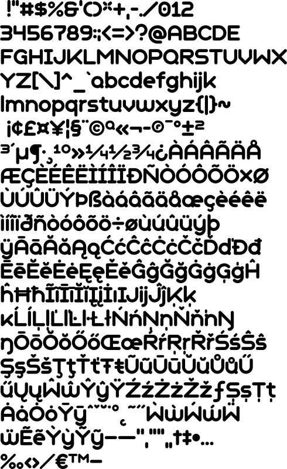

# geometrysoftpro_boldn



To use this font in your code, simply import it:

```go
import (
	. "github.com/gmlewis/go-fonts/fonts"
	_ "github.com/gmlewis/go-fonts/fonts/geometrysoftpro_boldn"
)

func main() {
	// ...
	render, err := Text(x, y, xs, ys, message, "geometrysoftpro_boldn"),
	// ...
}
```
