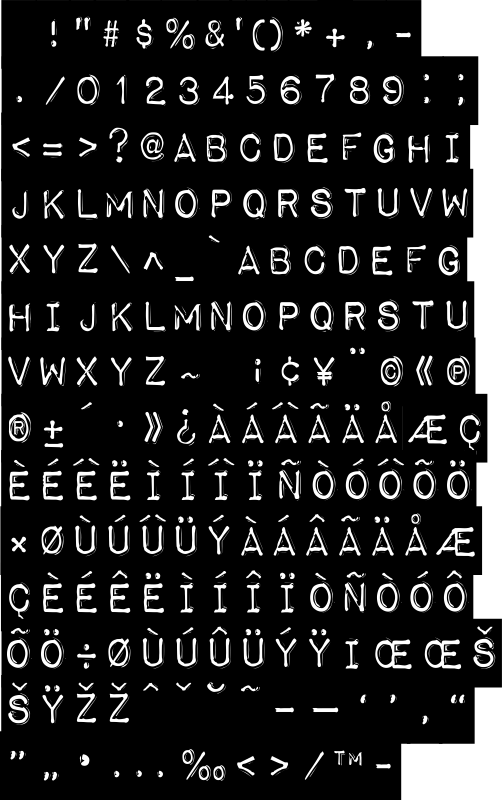

# impactlabel



To use this font in your code, simply import it:

```go
import (
  . "github.com/gmlewis/go-fonts/fonts"
  _ "github.com/gmlewis/go-fonts/fonts/impactlabel"
)

func main() {
  // ...
  render, err := fonts.Text(xPos, yPos, xScale, yScale, message, "impactlabel", Center)
  if err != nil {
    return err
  }
  log.Printf("MBB: %v", render.MBB)
  for _, poly := range render.Polygons {
    // ...
  }
  // ...
}
```
