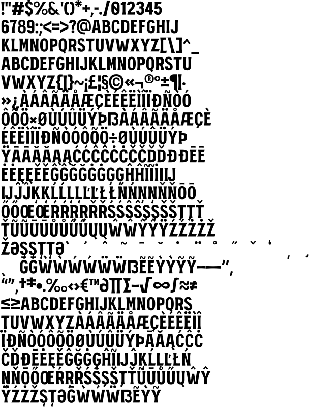

# mrkmaston_bold



To use this font in your code, simply import it:

```go
import (
  "github.com/gmlewis/go-fonts/fonts"
  _ "github.com/gmlewis/go-fonts/fonts/mrkmaston_bold"
)

func main() {
  // ...
  xPos, yPos, xScale, yScale := 0.0, 0.0, 1.0, 1.0
  message := "Sample from mrkmaston_bold"
  render, err := fonts.Text(xPos, yPos, xScale, yScale, message, "mrkmaston_bold", &fonts.Center)
  if err != nil {
    log.Fatal(err)
  }
  log.Printf("MBB: %v", render.MBB)
  for i, poly := range render.Polygons {
    log.Printf("Polygon #%v/%v has %v points. MBB: %v", i+1, len(render.Polygons), len(poly.Pts), poly.MBB)
    // ...
  }
  // ...
}
```
