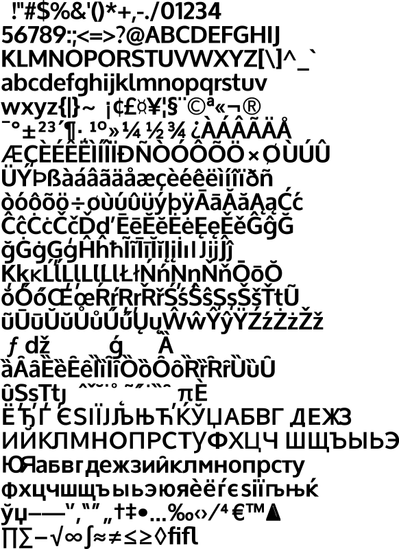

# oxygen_bold



To use this font in your code, simply import it:

```go
import (
	. "github.com/gmlewis/go-fonts/fonts"
	_ "github.com/gmlewis/go-fonts/fonts/oxygen_bold"
)

func main() {
	// ...
	Text(x, y, 1.0, message, "oxygen_bold", pts),
	// ...
}
```
